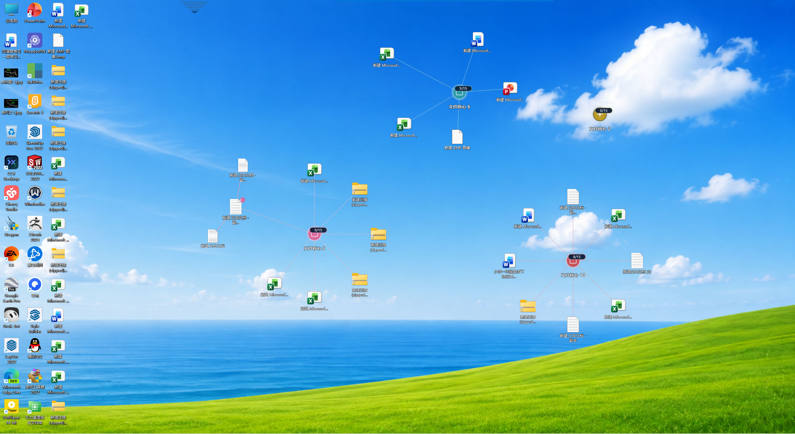
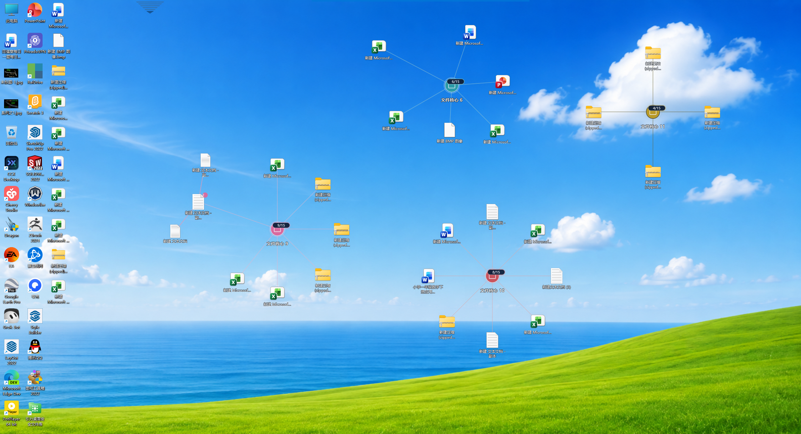
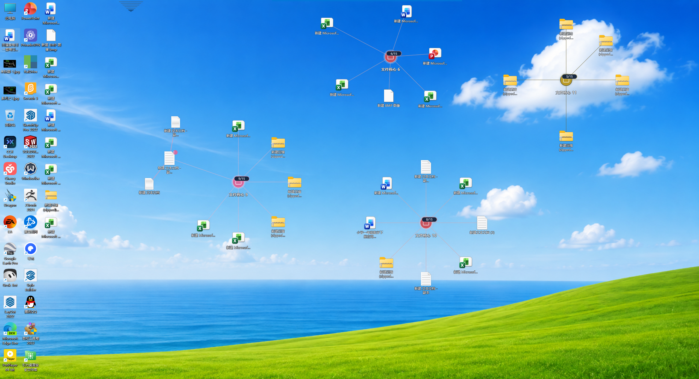

# Gravity Desktop

## 图标总乱跑难找？

## Desktop icons keep moving around?

**Gravity Desktop 帮你把常用图标固定在熟悉的位置。**

**Gravity Desktop keeps your everyday shortcuts where you expect them.**

把图标固定在你记得住的地方。

Keep your icons where you remember them.

[**从 Microsoft Store 下载 / Get it on Microsoft Store**](https://apps.microsoft.com/store/detail/9P4Q9JK2DV8R?cid=DevShareMCLPCS)

## 桌面越满，熟悉的位置越难找 / A familiar desktop can be hard to scan

文件、文件夹和快捷方式不断增加，桌面内容或布局一变化，熟悉的图标就可能换了位置。找一个常用项目，常常又得从头扫一遍桌面——像在玩“找不同”。

As files, folders, and shortcuts add up, a refresh, sort, or layout change can leave familiar icons somewhere else. Finding one item means scanning the desktop again—like playing “spot the difference.”

问题不只是桌面看起来乱，而是你不得不反复重新记住东西放在哪里。Gravity Desktop 希望通过熟悉的视觉位置，减少寻找桌面图标和快捷方式的重复搜索。

The problem is more than a messy desktop: it is having to relearn where things are. Gravity Desktop is designed to make desktop icons and shortcuts easier to find by keeping their visual layout familiar.

## 把常用项目放在熟悉的 Core 周围 / Keep everyday items around familiar Cores

把经常一起使用的文件、文件夹、程序和快捷方式围绕 Gravity Core 组织。Gravity Desktop 保存你在 Core 中安排的视觉位置和关系，让空间记忆帮你找到目标：**“要找它，就去那个 Core 附近。”**

Arrange frequently used files, folders, apps, and shortcuts around a Gravity Core. Gravity Desktop preserves the visual positions and relationships you set up, so spatial memory can help: **“If I need it, I know which Core to look near.”**

这不是锁定 Windows Explorer 的所有原生桌面图标；它管理的是你放入 Gravity Core 的项目及其视觉布局。

Gravity Desktop does not lock every native Windows desktop icon. It organizes the items you place in Gravity Cores and their visual layout.

## 为熟悉的位置而设计 / Designed for familiar places

- **熟悉的位置 / Familiar locations** — 让常用桌面图标待在你记得住的地方。
- **视觉 Core / Visual Cores** — 把相关项目围绕同一个 Core 组织起来。
- **视觉关系 / Visual relationships** — 一眼看出哪些项目属于同一组。
- **更快找到 / Find things faster** — 少一些全桌面扫描，多一些凭熟悉位置直接找到目标。
- **保持 Windows 使用习惯 / Keep your Windows workflow** — 用熟悉的文件、文件夹和快捷方式，不必重新学习一套文件系统。

## 查看演示 / Watch the demo

[**观看 Gravity Desktop 演示视频 / Watch the Gravity Desktop demo**](media/gravity-desktop-demo-20261005.mp4)

## 下载 / Download

Gravity Desktop 的唯一官方安装和更新渠道是 Microsoft Store。请从商店安装，避免使用来源不明的安装文件。

The Microsoft Store is the only official installation and update channel for Gravity Desktop. Install from the Store rather than using unofficial packages.

[**Microsoft Store — 下载 Gravity Desktop / Get Gravity Desktop**](https://apps.microsoft.com/store/detail/9P4Q9JK2DV8R?cid=DevShareMCLPCS)

## 版本信息 / Release information

- 当前版本 / Current version: **1.0.20.0**
- 平台 / Platform: **Windows x64**
- 安装 / Installation: **Microsoft Store only**

本项目为闭源软件。此公开仓库用于产品介绍和演示素材；不分发产品源码、EXE 或 MSIX 安装包。

Gravity Desktop is closed source. This public repository contains product information and demonstration media; it does not distribute source code, EXE files, or MSIX packages.

---

Copyright © 2026 Gravity Desktop. All rights reserved.
